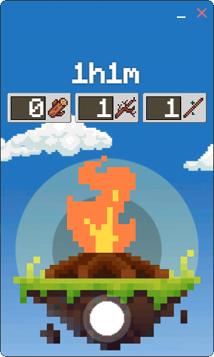

<a href='https://ko-fi.com/lukylix' target='_blank'>

# Welcome adventurer, 🍻

Welcome to the realm of Igni, a pixel art-style application tailored to help you seamlessly schedule system shutdowns. With Igni, your quest for better power management and digital health is only a fingertip away. Dive into the world of pixel art while ensuring no more unnecessary power usage. Let Igni guide your journey towards an energy-efficient digital life.

## 🎮 Getting Started

To initiate your journey, install Igni from the [release page](https://github.com/Lukylix/Igni/releases). Boot up the app, and let the adventure towards effective power management commence.

## 🗺️ How to Navigate

The Igni realm is as immersive as it is intuitive. The pixel art UI will transport you into a world reminiscent of your favorite RPGs, making navigation an adventure in itself.

### Screenshots

## ⚙️ How to Schedule a Shutdown

1. Select the Campire:  
   It's the gateway to your shutdown schedule.

2. Set Your Flame Power:  
   To set your shutdown time, press down on the campfire. Move your mouse upwards to increase the shutdown time or downwards to decrease it. Release the mouse when you've selected your desired shutdown time. It's like casting a spell in a fantasy world.

3. Ignite:  
   Once satisfied, press the floating orb. Watch as your Igni assistant, invoke the spell, finalizing your shutdown schedule.

Igni offers more methods for you to wield your power over time and device shutdown. Explore these additional features to fully master the power of Igni.

Remember, you can always press the orb to adjust or cancel your scheduled shutdown.

## 🧙‍♂️ Extra Powers: Quick Time Manipulation

In the Igni realm, you hold greater powers than you may have initially believed. Discover these enhanced abilities to truly unlock your prowess in managing time and system shutdowns.

### 🎲 Quick Spell Casting: Direct Time Input

For those who wish to manipulate time with precision and agility:

1. **Double Tap the Campfire:**  
   A double tap on the mystic campfire will summon a dialog box where the power to manipulate time lies.

2. **Invoke the Time Spell:**  
   Add wood to your fire in the given boxes.

This technique allows you to control the flow of time accurately, ensuring the system hibernation obeys your exact command.

### 🖲️ Scroll of Time Adjustment

For those who wish to adjust the flow of time in a seamless and effortless manner:

1. **Hover Over the Campfire:**  
   Direct your cursor to hover above the enchanted campfire.

2. **Manipulate Time:**  
   Turning the mouse wheel upward will bend time, increasing the duration before shutdown. Conversely, turning it downward will hasten time, reducing the shutdown countdown.

This scroll enchantment offers a quick and fluid way to control the system's power, allowing you to adapt and respond to changing circumstances swiftly.

With these additional mystical powers in your possession, your journey towards power mastery in the Igni realm becomes even more thrilling. Remember, you command the flow of time and energy. Happy adventuring, time mage!

## 🔥 Time Before a Shutdown

The magical flame within Igni serves as a visual representation of the remaining time before a scheduled shutdown. This feature transforms the mundanity of waiting into an engaging, visually satisfying experience. Here's how it works:

1. **5 Minutes Remaining - Low Flame:** When there are only five minutes left until the scheduled shutdown, the flame within Igni flickers low and slow, reminding you of the impending shutdown.

2. **30 Minutes Remaining** - Medium Flame: As the countdown reaches the 30-minute mark, the flame grows to a medium size, indicating that half an hour remains before your device rests.

3. **60 Minutes Remaining** - Larger Flame: At the 60-minute mark, the flame swells even larger. This is Igni's way of alerting you that there's still one hour left before shutdown.

4. **More Than 60 Minutes Remaining** - Max Flame: When the countdown is superior at 60 minutes, the flame within Igni is at its maximum size. It's a visual cue that you have 1 hours or more of activity left before your device starts its well-deserved break.

The flame's size provides an intuitive and visually appealing indication of the remaining time, helping you plan and prepare accordingly. Now, managing your device's shutdown schedule will feel just like playing your favorite pixel art MMO RPG!

## 🌠 Pixel Art Style Graphics

Igni's user interface is reminiscent of a classic RPG, brought to life with pixel art style graphics. Every pixel, and every interaction feels like an adventure waiting to unfold.

## 🔐 Privacy and Security

We value your privacy as much as you do. Igni does not collect any personal information. Its sole function is to schedule shutdowns according to your preferences.

## 🆘 Support

Should you encounter any dragons or need assistance navigating through Igni's world, our guild of developers stands ready to assist. Reach out to us via the issue tab on Github.

## 🔄 Updates

Igni continuously evolves, receiving regular updates to improve your experience, introduce new features, and vanquish any bugs.

With this guide, we hope you're ready to embark on your quest with Igni. Brace yourself for a unique adventure in power management. Happy adventuring!

## 🤝 Contributors

